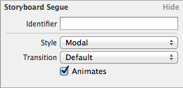
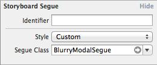

# BlurryModalSegue

BlurryModalSegue is a UIStoryboardSegue subclass that provides a blur effect for modal storyboard segues.  It provides the look and feel of a transparent modal overlay without deviating from the modal presentation model provided by Apple.

## Demo


## Installation
Via [Cocoapods](http://cocoapods.org):
```ruby
pod 'BlurryModalSegue'
```

## Usage

### Storyboard Usage

Change your modal storyboard segues from this:



To this:



Done!

_If nested view controllers are being presented (e.g., UINavigationController -> UIViewController), make sure to set the background color of any nested views to [UIColor clearColor] so the blurry UIImageView is visible_
### Custom Styling

BlurryModalSegue conforms to the UIAppearance protocol.  Configure it once across the app:

```objc
- (BOOL)application:(UIApplication *)application didFinishLaunchingWithOptions:(NSDictionary *)launchOptions
{
    [[BlurryModalSegue appearance] setBackingImageBlurRadius:@(20)];
    [[BlurryModalSegue appearance] setBackingImageSaturationDeltaFactor:@(.45)];
    
    return YES;
}
```

Additionally, you can customize individual instances before presentation, just implement ```prepareForSegue:sender:```:
```objc
- (void)prepareForSegue:(UIStoryboardSegue *)segue sender:(id)sender
{
    if ([segue isKindOfClass:[BlurryModalSegue class]])
    {
        BlurryModalSegue* bms = (BlurryModalSegue*)segue;
        
        bms.backingImageBlurRadius = @(20);
        bms.backingImageSaturationDeltaFactor = @(.45);
        bms.backingImageTintColor = [[UIColor greenColor] colorWithAlphaComponent:.1];
    }
}

```

### Troubleshooting
If you just see a solid color instead of a blurry background after performing a segue, ensure that the view controllers being presented don't have a background color set on their views.  This is common when presenting a UINavigationController that is in turn presenting a root view controller.  The UIImageView that contains the blurry image is added as a subview to the `-[UIStorybardSegue destinationViewController]`'s `view` property.  In the case of a presented UINavigationController, it immediately presents a child view controller.  If that view controller has a solid background color, it could completely hide the blurry UIImageView.

## Compatibility/Restrictions
* iOS7+ only, as we take advantage of the new ```UIViewControllerTransitionCoordinator```.
* ```UIModalTransitionStylePartialCurl``` is not supported and doesn't really make sense for this library.
* For ```UIModalTransitionStyleCoverVertical```, eagle-eyed developers will notice that the effect is better during presentation than dismissal.  This is because ```[UIViewController -transitionCoordinator]``` only seems to support the presentation, not the dismissal.  I believe the dismissal could be implented using the ```[UIViewController -transitioningDelegate]```, but that is TBD.
* Rotation after modal presentation is unsupported as the backing image will only be appropriate for the original orientation.

## Acknowledgements
* The blur effect in this library is courtesy of the [UIImage-BlurredFrame](https://github.com/Adrian2112/UIImage-BlurredFrame) library.
